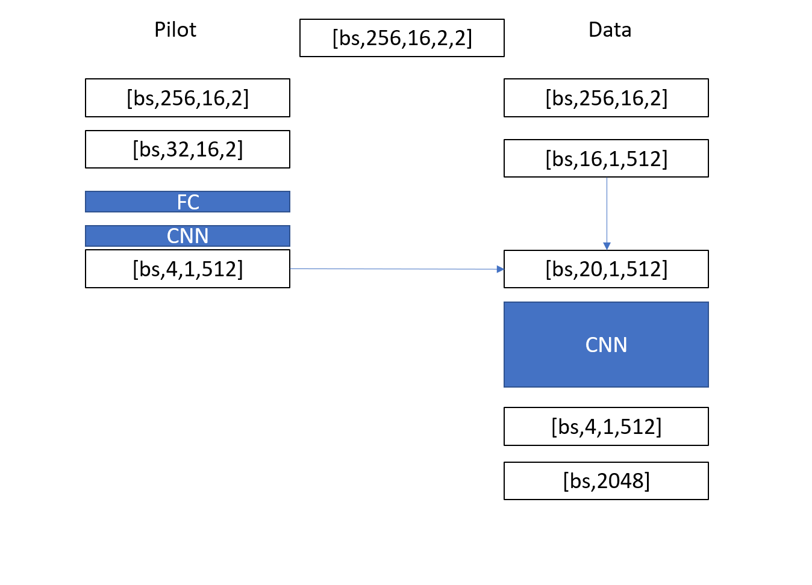

# naic_2021_CSI_Feedback
2021年全国人工智能大赛 “AI+无线通信” 赛道  
初赛 Score：72.5  Rank 25  
复赛Score：0.9970  Rank15  

## 初赛  
信道数据来源于多个复杂场景下采样得到的真实无线信道信息，数据集包含 10,000 个信道数据样本，覆盖多个复杂场景，每个场景包含若干样本。每个样本是一个 126*128 的二维 CSI 矩阵（可以把单个样本视为一张图片），其中 126 代表时延抽头数目，128 代表天线数目（32 发 4 收）。每个场景内的 CSI 样本具有一定的特征相关度。  

网络结构如下：

## 复赛  
复赛第一阶段采用全连接网络训练BER很容易突破0.5，但达到0.2以后就很难收敛。  
复赛第二阶段采用全连接+CNN的方式进行训练，优于全连接，但BER也只能达到0.12  
复赛第三阶段对导频信号和数据信号进行分开处理，丢弃导频信号中无导频位置的数据，减少噪声影响，并且数据信号部分不使用全连接层处理。这一块花了一些时间去理解为什么有全连接层时很容易收敛而去掉全连接后模型则不易收敛，重点在于数据信号输入到CNN如何做Reshape，哪些维度作为通道，对哪些维度进行卷积。最终处理方式如下图。模型大小为189Mb，满足赛题模型大小500Mb以内的要求。

CNN部分采用卷积核7，参考Resnet残差思想进行加深。后续改进方向可以考虑通道attention或者SElayer进行模型加宽。
实验中发现模型训练初期采用MSE损失函数收敛较快，而后期采用BCE损失函数收敛较快。
使用所有信道数据进行训练，初期采用MSE训练2000个epoch，后期采用BCE训练6000个epoch左右，在线验证集的BER为0.0049, 提交线上成绩为0.9970.

复赛阶段的模型设计参考了上一届大佬的设计思想https://github.com/wuminghui123/AI_com_semifinal
